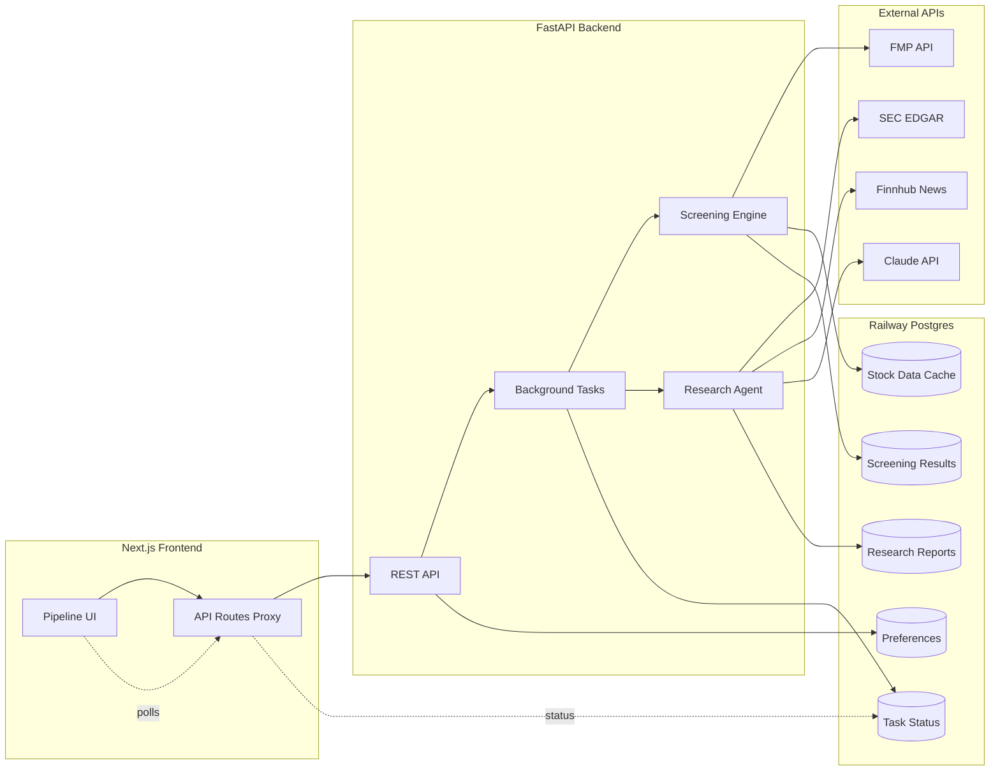

# feat: Build stock analysis pipeline

## Summary

A monorepo with a FastAPI backend and Next.js frontend, deployed as separate Railway services sharing a private Postgres database. The backend handles all external API calls (FMP, SEC EDGAR, Finnhub, Claude), screening logic, and data persistence. The frontend is a pipeline-style UI with three stages: screening results, triage, and research reports. Long-running tasks use FastAPI background tasks with status polling from the frontend.

---

## Problem Frame

The user has value investing knowledge from the NMW course but no tooling to operationalize it. Manual screening with Finviz and spreadsheets is too slow, and the qualitative research step (reading 10-Ks, parsing shareholder letters) is where most individual investors give up. This plan implements the pipeline defined in the origin requirements doc. (see origin: `docs/brainstorms/stock-analysis-pipeline-requirements.md`)

---

## Requirements

- R1. Screen US stocks using configurable value investing metric filters (P/E, Forward P/E, PEG, P/B, P/S, Price/Cash, Price/FCF, EPS growth variants, ROE, ROA, ROI, current ratio, quick ratio, debt/equity, LT debt/equity, margins, dividend yield)
- R2. Configurable metric thresholds with NMW course defaults
- R3. Composite value score with category-weighted metrics influenced by portfolio preferences
- R4. Screened stocks display: ticker, company name, sector/industry, key metrics, composite score, brief valuation summary (rule-based template for v1; AI upgrade path if templates prove insufficient)
- R5. Show conviction strength — how far above/below threshold each metric is
- R6. Browsable list/card view with sorting and filtering by any metric
- R7. Bulk selection: promote to deep research or reject in one action
- R8. Rejected stocks marked and excluded (but un-rejectable)
- R9. Fetch most recent 10-K, 10-Q, and key sections from SEC EDGAR
- R10. Pull recent news (3-6 months) via Finnhub
- R11. AI research report: overview, competitive position, financial health, growth trajectory, risks, buy/hold/avoid opinion with evidence
- R12. Direct links to source documents on SEC EDGAR
- R13. Configurable portfolio preferences: sectors, risk tolerance, hold duration, metric threshold overrides
- R14. Preferences influence scoring — preferred sectors rank higher but non-preferred stocks still appear
- R15. Next.js frontend + FastAPI backend on Railway
- R16. Railway PostgreSQL on private network
- R17. Free-tier data APIs; paid cost is Claude API tokens only
- R18. Database GUI setup (TablePlus)

**Origin actors:** A1 (Investor/user), A2 (Screening engine), A3 (Research agent)
**Origin flows:** F1 (Stock screening), F2 (Triage and selection), F3 (Deep research), F4 (Portfolio preference configuration)
**Origin acceptance examples:** AE1 (covers R4, R5), AE2 (covers R7, R8), AE3 (covers R14), AE4 (covers R9, R11, R12)

---

## Scope Boundaries

### Deferred for later

- Backtesting engine and historical pattern recognition
- Scheduled/automated screening runs
- Email or push notification alerts
- Side-by-side stock comparison view
- Watchlist functionality

### Outside this product's identity

- Automated trading or order execution
- Portfolio tracking of actual holdings/P&L
- Technical analysis signals (moving averages, RSI, chart patterns)
- Mobile app
- Multi-user or SaaS features

### Deferred for later (continued)

- Authentication layer beyond static token (not needed for single-user v1, add when/if deploying publicly)

---

## Context & Research

### External References

- **FMP API**: Screener endpoint (`/api/v3/stock-screener`) returns bulk results in 1 call. Key-metrics-ttm and ratios-ttm endpoints provide all needed value metrics. Batch profile calls via comma-separated tickers (1 request per 10 tickers). 250 req/day is sufficient — a full session uses ~20-30 requests.
- **SEC EDGAR + edgartools**: `edgartools` Python library wraps EDGAR API cleanly. Can extract individual 10-K items (Item 7: MD&A, Item 1A: Risk Factors) as text. CEO/shareholder letters are embedded in Item 7, not filed separately. Extracting key items only cuts Claude costs by ~60%.
- **Finnhub**: Free tier at 60 req/min with native ticker filtering (`/company-news?symbol=AAPL`). Best free stock news API available.
- **Claude API costs**: ~$0.48 per 10-K analysis with Sonnet (150K input tokens). With item extraction (~50K tokens), drops to ~$0.19. Batch API halves costs further. 5-10 stocks per session = $1-5.
- **Railway private networking**: Backend service gets `backend.railway.internal` DNS. Next.js server-side code (API routes) calls this directly at zero latency. Client-side browser requests proxy through Next.js API routes to avoid CORS and expose only the frontend URL.
- **yfinance as fallback (deferred for v1)**: The origin doc lists yfinance as a data source fallback alongside FMP. For v1, FMP is the sole data source with aggressive caching to stay within limits. yfinance remains the documented fallback path if FMP limits become restrictive or the free tier changes — the `fmp_client.py` adapter pattern makes swapping straightforward.

---

## Key Technical Decisions

- **FastAPI over Flask/Django**: Async by default, auto-generated OpenAPI docs, clean type hints with Pydantic, lightweight. Perfect for an API-focused backend with background tasks.
- **Background tasks with polling over Celery/Redis**: Single-user tool doesn't need a distributed job queue. FastAPI's `BackgroundTasks` + a `task_status` table + frontend polling keeps infrastructure minimal. Jobs write progress to the DB; frontend polls a status endpoint every 2-3 seconds.
- **Category-weighted composite scoring**: Instead of per-metric weights (overwhelming UI), group metrics into 4 categories: Value (P/E, PEG, P/B, P/S, Price/Cash, Price/FCF), Growth (EPS growth variants, sales growth), Financial Health (current ratio, quick ratio, debt ratios), Profitability (ROE, ROA, ROI, margins, dividend yield). Each category gets a configurable weight (default equal). Stocks score 0-100 with sector preference bonus. (Resolves origin outstanding question on R3)
- **FMP data caching in Postgres**: Fetch and cache fundamental data. Screen against cached data to stay within 250 req/day. Refresh on-demand or when data is stale (>24 hours). (Resolves origin assumption on FMP rate limits)
- **Extract key 10-K items, not full filing**: Use edgartools to extract Item 7 (MD&A) + Item 1A (Risk Factors) + Item 8 (Financial Statements summary). ~50K tokens vs 150K+ for full filing. Saves 60% on Claude costs while retaining highest-signal content. (Resolves origin outstanding questions on R9 and R17)
- **Finnhub for news**: 60 req/min free tier with native ticker filtering. (Resolves origin outstanding question on R10)
- **REST API via Next.js API routes as proxy**: Frontend never calls FastAPI directly from the browser. Next.js API routes proxy to `backend.railway.internal` — single public URL, no CORS, clean architecture. The FastAPI service's public domain must be disabled in Railway settings so only the Next.js frontend is publicly accessible. (Resolves origin outstanding question on R15)
- **Static token authentication for v1**: A `SITE_SECRET` env var checked by Next.js middleware on all routes. Requests without a valid `Authorization: Bearer <token>` header (or a `?token=<token>` query param for browser access) receive a 401. This prevents unauthorized access to the Railway-deployed tool and protects the Anthropic API key from abuse. Trivial to implement — one middleware file, one env var.
- **Claude Sonnet for analysis**: Best cost/quality tradeoff for structured financial analysis. Use prompt caching for the analysis system prompt (same template across all filings).

---

## Open Questions

### Resolved During Planning

- **Composite scoring approach (R3)**: Category-weighted scoring with 4 categories, user-configurable weights, 0-100 scale
- **Shareholder letter extraction (R9)**: Use edgartools to extract Item 7 (MD&A) which contains management's discussion including forward-looking statements
- **News API (R10)**: Finnhub free tier — best coverage, most generous limits
- **Frontend-backend communication (R15)**: Next.js API routes proxy to FastAPI on Railway private network
- **Claude token costs (R17)**: ~$0.19-0.48 per filing depending on extraction strategy; $1-5 per session

### Deferred to Implementation

- Exact NMW course default thresholds (R1, R2) — need to extract from the Chapter 11 Numbers spreadsheet during implementation. Ship with reasonable general value-investing defaults first, then calibrate.
- Optimal prompt template for Claude financial analysis — will iterate during U6 implementation
- Exact polling interval for background tasks — start with 3 seconds, adjust based on real task durations

### From 2026-05-15 review

- [Affects U4, U5, U7] `ce-frontend-design` execution notes reference an undefined tool/skill — clarify what this means for implementers (e.g., a compound-engineering skill, a Figma file, or a specific design component library) or replace with a concrete tool reference
- [Affects U5] U5 previously declared U4 as a hard dependency, now removed — confirm that U4 and U5 can be built in parallel (U5 renders default preferences until U4 ships)
- [Affects U7] Research report page layout model needs a decision — two-column (report body left, metrics + opinion badge sticky right) vs single-column with collapsible sidebar. Where does the opinion badge live — fixed page header or within the Investment Opinion section? Responsive behavior: sidebar becomes expandable drawer or moves to report top on narrow viewports.
- [Affects U7] Dashboard empty/first-run states need enumeration: (1) no preferences + no runs → onboarding CTA pointing to settings, (2) preferences set + no runs → "Run your first screen" CTA, (3) run complete + no stocks promoted → prompt to adjust thresholds, (4) stocks in research → progress summary, (5) reports complete → summary with quick links

---

## Output Structure

```
stock-analyzer/
├── frontend/                    # Next.js app
│   ├── src/
│   │   ├── app/                 # App Router pages
│   │   │   ├── page.tsx         # Dashboard / screening trigger
│   │   │   ├── screening/       # Screening results + triage
│   │   │   ├── research/        # Research reports
│   │   │   └── settings/        # Portfolio preferences
│   │   ├── components/          # Shared UI components
│   │   │   ├── stock-card.tsx
│   │   │   ├── metric-badge.tsx
│   │   │   └── ...
│   │   └── lib/                 # API client, types, utils
│   ├── package.json
│   └── next.config.js
├── backend/                     # Python FastAPI
│   ├── app/
│   │   ├── main.py              # FastAPI app entry
│   │   ├── api/                 # Route modules
│   │   │   ├── screening.py
│   │   │   ├── research.py
│   │   │   ├── preferences.py
│   │   │   └── tasks.py
│   │   ├── services/            # Business logic
│   │   │   ├── fmp_client.py    # FMP API client
│   │   │   ├── screener.py      # Screening engine
│   │   │   ├── scorer.py        # Composite scoring
│   │   │   ├── edgar_client.py  # SEC EDGAR + edgartools
│   │   │   ├── news_client.py   # Finnhub client
│   │   │   └── research_agent.py # Claude analysis
│   │   ├── models/              # SQLAlchemy models
│   │   ├── schemas/             # Pydantic schemas
│   │   └── db.py                # Database connection
│   ├── alembic/                 # DB migrations
│   ├── requirements.txt
│   └── Dockerfile
├── docker-compose.yml           # Local dev (Postgres + both services)
└── README.md
```

---

## High-Level Technical Design

> *This illustrates the intended approach and is directional guidance for review, not implementation specification. The implementing agent should treat it as context, not code to reproduce.*



**Data flow for screening:**
1. User triggers screen → API creates background task → returns task ID
2. Background task: FMP screener endpoint → filter candidates → fetch detailed metrics for matches → apply metric thresholds → compute composite scores → store results in Postgres → mark task complete
3. Frontend polls task status → on completion, fetches and displays results

**Data flow for deep research:**
1. User selects stocks → API creates research background task per stock
2. Background task per stock: edgartools extracts 10-K items + Finnhub fetches news → Claude analyzes combined input → structured report stored in Postgres → task marked complete
3. Frontend polls → on completion, displays research report with source links

---

## Implementation Units

### U1. Project scaffolding and Railway setup

**Goal:** Monorepo structure with FastAPI backend, Next.js frontend, Railway Postgres, local dev environment, and database schema.

**Requirements:** R15, R16, R18

**Dependencies:** None

**Files:**
- Create: `stock-analyzer/backend/app/main.py`
- Create: `stock-analyzer/backend/app/db.py`
- Create: `stock-analyzer/backend/app/models/base.py`
- Create: `stock-analyzer/backend/app/models/stock.py`
- Create: `stock-analyzer/backend/app/models/screening.py`
- Create: `stock-analyzer/backend/app/models/research.py`
- Create: `stock-analyzer/backend/app/models/preference.py`
- Create: `stock-analyzer/backend/app/models/task.py`
- Create: `stock-analyzer/backend/requirements.txt`
- Create: `stock-analyzer/backend/Dockerfile`
- Create: `stock-analyzer/backend/alembic.ini`
- Create: `stock-analyzer/backend/alembic/env.py`
- Create: `stock-analyzer/frontend/package.json`
- Create: `stock-analyzer/frontend/next.config.js`
- Create: `stock-analyzer/frontend/src/app/layout.tsx`
- Create: `stock-analyzer/frontend/src/app/page.tsx`
- Create: `stock-analyzer/frontend/src/lib/api.ts`
- Create: `stock-analyzer/docker-compose.yml`
- Create: `stock-analyzer/README.md`

**Approach:**
- Monorepo with `backend/` and `frontend/` directories
- Docker Compose for local dev: Postgres, FastAPI (hot reload), Next.js (dev server)
- SQLAlchemy models for all tables: `stocks` (cached fundamental data), `screening_runs` + `screening_results` (screening history), `research_reports` (AI analysis), `portfolio_preferences` (user config), `task_status` (background job tracking)
- Alembic for migrations with an initial migration creating all tables
- FastAPI app with CORS middleware, health check endpoint
- Next.js with App Router, Tailwind CSS, basic layout shell
- API client utility in frontend for calling Next.js API route proxies
- Railway: configure two services pointing to `backend/` and `frontend/` root directories, add Postgres plugin, set `DATABASE_URL` env var. **Disable public domain on the FastAPI service** — only the Next.js frontend should be publicly reachable. Set `SITE_SECRET` env var on the frontend service for static token auth.
- Secrets management: create `.env.example` with placeholder values for all API keys (`FMP_API_KEY`, `ANTHROPIC_API_KEY`, `FINNHUB_API_KEY`, `DATABASE_URL`, `SITE_SECRET`). Add `.env` to `.gitignore`. Use separate API keys for local dev vs Railway production.
- TablePlus: document connection setup in README using a placeholder connection string (never commit real `DATABASE_URL`)

**Database schema (key tables):**
- `stocks`: ticker, company_name, sector, industry, market_cap, metric columns (P/E, PEG, P/B, ROE, etc.), last_updated timestamp
- `screening_runs`: id, created_at, filter_config (JSON), status
- `screening_results`: id, screening_run_id, stock_ticker, composite_score, metric_snapshot (JSON), pass_reasons (JSON), stage (screened/researching/researched/rejected)
- `research_reports`: id, stock_ticker, report_content (JSON), sources (JSON), created_at
- `portfolio_preferences`: id, preferred_sectors (JSON array), risk_tolerance, hold_duration, category_weights (JSON), metric_overrides (JSON)
- `task_status`: id, task_type, status (pending/running/completed/failed), result_id, progress (string enum — screening: `fetching_data` / `applying_filters` / `scoring` / `complete`; research: `fetching_filing` / `extracting_sections` / `fetching_news` / `analyzing` / `storing` / `complete`), error_message, created_at, completed_at

**Patterns to follow:**
- Standard FastAPI project structure with separate route and service modules
- SQLAlchemy 2.0 style with mapped_column
- Next.js 14+ App Router conventions

**Test scenarios:**
- Happy path: FastAPI health endpoint returns 200
- Happy path: Database connection established, all tables created via migration
- Happy path: Next.js dev server starts and renders layout shell
- Happy path: Docker Compose brings up all three services (Postgres, backend, frontend)
- Edge case: Backend starts gracefully when database is temporarily unavailable (connection retry)

**Verification:**
- `docker compose up` starts all services without errors
- Backend API docs accessible at `/docs`
- Frontend renders at `localhost:3000`
- Alembic migration creates all tables in Postgres
- TablePlus connects to local Postgres and shows all tables

---

### U2. Financial data client and caching

**Goal:** FMP API client that fetches fundamental data, caches it in Postgres, and stays within the 250 req/day free tier.

**Requirements:** R1, R17

**Dependencies:** U1

**Files:**
- Create: `stock-analyzer/backend/app/services/fmp_client.py`
- Create: `stock-analyzer/backend/app/api/data.py`
- Create: `stock-analyzer/backend/app/core/config.py`
- Test: `stock-analyzer/backend/tests/test_fmp_client.py`

**Approach:**
- FMP client class wrapping httpx (async HTTP)
- Screener endpoint (`/api/v3/stock-screener`) for initial bulk candidate fetch — returns tickers matching basic criteria (market cap, sector, country)
- Batch profile endpoint for company metadata (comma-separated tickers, 10 per request)
- Key-metrics-ttm and ratios-ttm endpoints for detailed fundamental data per stock
- Cache all fetched data in the `stocks` table with `last_updated` timestamp
- Staleness check: data older than 24 hours is eligible for refresh
- Rate limiter: track daily request count, warn when approaching 250
- Config via environment variables: `FMP_API_KEY`
- API endpoint to trigger a data refresh for specific tickers or all cached stocks

**Patterns to follow:**
- httpx async client with connection pooling
- Pydantic models for API response validation

**Test scenarios:**
- Happy path: Screener endpoint returns list of tickers matching criteria
- Happy path: Batch profile fetch for 10 tickers returns all company metadata in 1 request
- Happy path: Key metrics fetch returns all required value investing metrics for a ticker
- Happy path: Fetched data is cached in stocks table with correct timestamp
- Edge case: Stale data (>24h) triggers refresh on next access
- Edge case: Fresh data (<24h) is served from cache without API call
- Error path: FMP API returns rate limit error (429) — graceful handling with cached data fallback
- Error path: FMP API returns invalid/missing data for a ticker — skip that ticker, log warning
- Edge case: Daily request count approaching 250 — log warning, block non-essential fetches

**Verification:**
- Can fetch and cache fundamental data for 50+ stocks within rate limits
- Cached data is returned for subsequent requests without API calls
- All required metrics (P/E, PEG, P/B, ROE, debt/equity, margins, EPS growth, dividend yield) are captured

---

### U3. Screening engine and composite scoring

**Goal:** Apply configurable metric filters to cached stock data, compute composite scores with category weights, and generate quick valuation summaries.

**Requirements:** R1, R2, R3, R4, R5, R14

**Dependencies:** U2

**Files:**
- Create: `stock-analyzer/backend/app/services/screener.py` (includes inline summary generation)
- Create: `stock-analyzer/backend/app/services/scorer.py`
- Create: `stock-analyzer/backend/app/api/screening.py`
- Create: `stock-analyzer/backend/app/schemas/screening.py`
- Test: `stock-analyzer/backend/tests/test_screener.py`
- Test: `stock-analyzer/backend/tests/test_scorer.py`

**Approach:**
- Screener service: takes a filter config (metric thresholds) and portfolio preferences, queries the stocks table, applies filters, returns passing stocks with per-metric pass/fail data
- Default thresholds: P/E < 20, PEG < 1.5, P/B < 3, ROE > 15%, current ratio > 1.5, debt/equity < 1.0, gross margin > 30%, dividend yield > 1%. These are reasonable Buffett-style defaults — will calibrate with NMW course data later.
- Conviction strength: for each metric, calculate percentage above/below threshold (e.g., "P/E: 10, 50% below threshold of 20")
- Scorer service: normalizes each metric to 0-1, groups into 4 categories (Value, Growth, Financial Health, Profitability), applies category weights, adds sector preference bonus (+10 points for preferred sectors), outputs 0-100 composite score
- Summary generation (inline in screener.py): rule-based template that produces a 1-2 sentence valuation case from the metrics (e.g., "Low P/E of 8.3 vs sector average of 18, strong ROE at 22%, minimal debt"). No AI needed for this step — template is sufficient and cost-free. Promote to a separate module only if a second consumer emerges.
- Background task: trigger screening as a background job, store results in `screening_results` table, update `task_status`
- API endpoints: POST `/api/screening/run` (trigger), GET `/api/screening/{run_id}/results` (fetch results), GET `/api/screening/{run_id}/status` (poll status)

**Patterns to follow:**
- Pydantic schemas for filter configs and response models
- Background task pattern with task_status table

**Test scenarios:**
- Covers AE1. Happy path: Stock with P/E of 10 (threshold < 20) shows "50% below threshold"; stock with ROE of 25% (threshold > 15%) shows "67% above threshold"
- Happy path: Stock passing all filters appears in results with composite score
- Happy path: Stock failing any filter is excluded from results
- Covers AE3. Happy path: Two stocks with equal fundamentals — one in preferred sector scores higher due to sector bonus
- Happy path: Summary generator produces readable valuation case for a passing stock
- Edge case: Stock missing a metric (null P/E) — exclude from that metric's filter but don't reject entirely unless it's a required metric
- Edge case: All stocks fail filters — return empty results with a message, not an error
- Edge case: Category weights sum to 0 — fall back to equal weighting
- Happy path: Background task updates progress and status throughout screening run
- Integration: Screening reads from cached stock data (U2) and writes results to screening_results table

**Verification:**
- A screening run against cached data produces ranked results with scores, conviction metrics, and summaries
- Changing category weights or thresholds produces different rankings
- Sector preference bonus visibly affects ordering

---

### U4. Portfolio preferences API and settings UI

**Goal:** CRUD for portfolio preferences (sectors, risk tolerance, hold duration, metric overrides, category weights) with a settings page in the frontend.

**Requirements:** R2, R13, R14

**Dependencies:** U1

**Files:**
- Create: `stock-analyzer/backend/app/api/preferences.py`
- Create: `stock-analyzer/backend/app/schemas/preferences.py`
- Create: `stock-analyzer/frontend/src/app/settings/page.tsx`
- Create: `stock-analyzer/frontend/src/components/sector-selector.tsx`
- Create: `stock-analyzer/frontend/src/components/metric-config.tsx`
- Test: `stock-analyzer/backend/tests/test_preferences.py`

**Execution note:** Use `ce-frontend-design` for the settings page UI to ensure a polished, intuitive configuration experience.

**Approach:**
- Single preferences record (single-user tool) — upsert on save
- API endpoints: GET `/api/preferences` (load), PUT `/api/preferences` (save)
- Settings page sections: Sector/Industry preferences (multi-select grid), Risk tolerance (conservative/moderate/aggressive selector), Hold duration (1-3y / 3-5y / 5y+), Category weights (4 sliders with aria-labels and keyboard step values: Value, Growth, Financial Health, Profitability), Metric threshold overrides (expandable section showing each metric with min/max inputs, pre-filled with defaults). Inline validation: error state when min > max on a metric pair, non-blocking advisory when saved thresholds would produce zero results against cached data, reset-to-default affordance per metric row.
- Sector list sourced from FMP sector data (cached)
- Changes apply to next screening run — no need to re-run automatically

**Patterns to follow:**
- Pydantic model with JSON fields for complex nested preferences
- Tailwind UI patterns for form controls

**Test scenarios:**
- Happy path: Save preferences with selected sectors, risk level, and category weights → GET returns same values
- Happy path: Override a metric threshold → value persists across page refreshes
- Edge case: Save with no sectors selected → all sectors eligible (no preference filter)
- Edge case: Category weights all set to 0 → backend normalizes to equal weights
- Edge case: Metric min > max → inline error prevents save
- Edge case: Very restrictive thresholds → advisory warning on save showing zero cached stocks would pass
- Happy path: Default preferences loaded on first visit (before any save)
- Integration: Saved preferences are used by screening engine (U3) on next run

**Verification:**
- Settings page loads with current (or default) preferences
- Changes are saved and reflected in subsequent screening runs
- Metric threshold overrides show sensible defaults that can be adjusted

---

### U5. Screening results and triage UI

**Goal:** Pipeline-style frontend showing screened stocks in a card/list view with sorting, filtering, bulk selection, promotion to research, and rejection.

**Requirements:** R4, R5, R6, R7, R8

**Dependencies:** U3

**Files:**
- Create: `stock-analyzer/frontend/src/app/screening/page.tsx`
- Create: `stock-analyzer/frontend/src/app/screening/[runId]/page.tsx`
- Create: `stock-analyzer/frontend/src/components/stock-card.tsx`
- Create: `stock-analyzer/frontend/src/components/metric-badge.tsx`
- Create: `stock-analyzer/frontend/src/components/conviction-bar.tsx`
- Create: `stock-analyzer/frontend/src/components/bulk-actions.tsx`
- Create: `stock-analyzer/frontend/src/components/pipeline-status.tsx`
- Create: `stock-analyzer/frontend/src/app/api/screening/route.ts`
- Create: `stock-analyzer/frontend/src/app/api/screening/[runId]/route.ts`
- Create: `stock-analyzer/frontend/src/app/api/preferences/route.ts`

**Execution note:** Use `ce-frontend-design` for the screening results page, stock cards, and triage controls. This is the primary interaction surface — it should feel like a professional investment tool, not a prototype.

**Approach:**
- Screening page: "Run Screen" button triggers background task → polls status → displays results when complete
- Stock card component: ticker, company name, sector badge, composite score (large, prominent), key metrics with conviction bars (visual indicators of how far above/below threshold), AI-generated summary text
- Conviction bar: colored bar showing metric value relative to threshold (green = well above/below threshold in the good direction, yellow = close to threshold, red = barely passing). Must include a text label alongside color (e.g., "Well above threshold", "Barely passing") for accessibility — color must never be the sole communication channel.
- Sorting: by composite score (default), any individual metric, sector, market cap
- Filtering: by sector, score range, individual metric ranges
- Bulk selection: checkboxes on cards (with accessible labels including ticker), "Select all" toggle, floating action bar sticky to viewport bottom — hidden when 0 selected, visible with count label ("3 selected") when ≥1
- Actions: "Research these" (promotes to deep research stage), "Reject" (immediate optimistic update — reversible via un-reject toggle, no confirm dialog needed). Partial failure: if research task fails for a subset, those stocks show error badge while successful ones update stage normally.
- Rejected toggle: "Show rejected" toggle to un-hide rejected stocks, with un-reject option
- Pipeline status indicator: shows how many stocks at each stage (screened / researching / researched / rejected)
- Next.js API routes proxy all requests to FastAPI backend on Railway private network

**Patterns to follow:**
- Tailwind CSS utility classes for all styling
- Next.js App Router with client components for interactive elements
- Optimistic UI updates for selection and rejection

**Test scenarios:**
- Covers AE1. Happy path: Stock card shows P/E with "50% below threshold" and conviction bar in green
- Covers AE2. Happy path: Select 5 stocks → click "Research these" → 5 stocks move to researching stage; select 3 → click "Reject" → 3 grayed out and excluded
- Happy path: Sort by composite score shows highest-scoring stocks first
- Happy path: Filter by sector "Technology" shows only tech stocks
- Edge case: Screening run returns 0 results — show helpful empty state with suggestion to adjust thresholds
- Edge case: Toggle "Show rejected" reveals rejected stocks with un-reject button
- Happy path: Pipeline status bar shows correct counts per stage
- Happy path: "Run Screen" → loading state showing progress phase label (e.g., "Fetching metrics for 230 stocks…") and elapsed time → results appear when task completes
- Edge case: Background task fails — error state with retry button

**Verification:**
- Can run a screening, browse results, sort and filter, bulk select, promote to research, and reject stocks — all from the UI
- Pipeline status accurately reflects stock counts at each stage
- Rejected stocks disappear but can be recovered

---

### U6. SEC EDGAR integration and AI research agent

**Goal:** Fetch SEC filings and news for selected stocks, generate structured AI research reports using Claude, and store them in the database.

**Requirements:** R9, R10, R11, R12, R17

**Dependencies:** U2, U3

**Files:**
- Create: `stock-analyzer/backend/app/services/edgar_client.py`
- Create: `stock-analyzer/backend/app/services/news_client.py`
- Create: `stock-analyzer/backend/app/services/research_agent.py`
- Create: `stock-analyzer/backend/app/api/research.py`
- Create: `stock-analyzer/backend/app/schemas/research.py`
- Test: `stock-analyzer/backend/tests/test_edgar_client.py`
- Test: `stock-analyzer/backend/tests/test_research_agent.py`

**Approach:**
- EDGAR client: uses `edgartools` library to fetch 10-K and 10-Q filings for a given ticker/CIK. From 10-K: extracts Item 1 (Business), Item 1A (Risk Factors), Item 7 (MD&A). From 10-Q: extracts Part I Item 2 (MD&A quarterly update) for the most recent quarter, providing more current context than the annual filing alone. If edgartools item extraction returns empty or raises an exception for a specific item, falls back to raw filing text truncated to ~50K tokens. Returns extracted text + filing metadata + SEC EDGAR URLs for source links.
- News client: uses Finnhub API to fetch company news for the last 6 months. Filters to top 10-15 most relevant articles by date and relevance. Config via `FINNHUB_API_KEY` env var.
- Research agent: orchestrates the analysis pipeline:
  1. Fetch filing sections via EDGAR client
  2. Fetch recent news via news client
  3. Combine into a structured prompt for Claude (Sonnet)
  4. System prompt: structured financial analyst template requesting JSON output with sections: company_overview, competitive_position, financial_health, growth_trajectory, key_risks, investment_opinion (buy/hold/avoid with confidence level and reasoning)
  5. Use prompt caching for the system prompt (same template across all analyses)
  6. Parse Claude's response and store in `research_reports` table with source links
- Background task: each stock selected for research gets its own background task. Tasks run concurrently (up to 3 at a time to respect API rate limits).
- API endpoints: POST `/api/research/run` (trigger for selected stocks), GET `/api/research/{report_id}` (fetch report), GET `/api/research/status/{task_id}` (poll status)
- Config via env vars: `ANTHROPIC_API_KEY`, `FINNHUB_API_KEY`

**Patterns to follow:**
- Anthropic Python SDK for Claude API calls with prompt caching
- edgartools patterns for filing extraction
- Structured JSON output from Claude using system prompt constraints

**Test scenarios:**
- Covers AE4. Happy path: Research for a known ticker (e.g., AAPL) fetches 10-K, extracts Item 7 + Item 1A, generates report with source links to SEC EDGAR
- Happy path: Finnhub returns recent news articles for the ticker
- Happy path: Claude generates structured report with all required sections (overview, competitive position, financial health, growth, risks, opinion)
- Happy path: Report includes buy/hold/avoid opinion with explicit reasoning tied to filing evidence
- Edge case: Company has no recent 10-K filing — report notes the gap, uses latest available
- Edge case: Finnhub returns no news — report notes lack of recent coverage, proceeds with filing analysis only
- Error path: Claude API error — task marked as failed with error message, user can retry
- Error path: EDGAR API unavailable — task fails gracefully with informative error
- Edge case: Very long filing text (>200K tokens) — truncate to most relevant sections to stay within context window
- Edge case: edgartools item extraction fails or returns empty for a specific item — falls back to raw text truncated to ~50K tokens
- Integration: Research task updates task_status table throughout; frontend can poll progress

**Verification:**
- A selected stock gets a complete research report with all required sections
- Report includes direct URLs to the 10-K and 10-Q on SEC EDGAR
- Claude's analysis references specific evidence from the filing text
- Multiple stocks can be researched concurrently without rate limit issues

---

### U7. Research reports UI and pipeline view

**Goal:** Display AI research reports with structured sections, source links, and a full pipeline view showing stocks across all stages.

**Requirements:** R11, R12

**Dependencies:** U5, U6

**Files:**
- Create: `stock-analyzer/frontend/src/app/research/page.tsx`
- Create: `stock-analyzer/frontend/src/app/research/[ticker]/page.tsx`
- Create: `stock-analyzer/frontend/src/components/research-report.tsx`
- Create: `stock-analyzer/frontend/src/components/opinion-badge.tsx`
- Create: `stock-analyzer/frontend/src/components/source-links.tsx`
- Create: `stock-analyzer/frontend/src/components/pipeline-view.tsx`
- Create: `stock-analyzer/frontend/src/app/api/research/route.ts`
- Create: `stock-analyzer/frontend/src/app/api/research/[ticker]/route.ts`

**Execution note:** Use `ce-frontend-design` for the research report layout and pipeline view. The report should feel like reading a professional equity research note — clean typography, clear section hierarchy, prominent opinion badge.

**Approach:**
- Research list page: shows all stocks currently in research or completed, with status indicators (pending / analyzing / complete / failed)
- Individual report page: structured layout with sections matching the Claude output: Company Overview, Competitive Position, Financial Health Assessment, Growth Trajectory, Key Risks, Investment Opinion
- Opinion badge: prominent buy/hold/avoid indicator with confidence level (high/medium/low), color coding (green/yellow/red), and text label (e.g., "Buy — High Confidence") — text must accompany color for accessibility
- Source links section: clickable links to 10-K and 10-Q on SEC EDGAR, news articles used in analysis
- Key metrics sidebar: shows the stock's screening metrics alongside the research report for context
- Pipeline view component: horizontal pipeline showing stages (Screened → Researching → Researched) with stock counts and ability to navigate to each stage's view
- Dashboard page (home): overview with latest screening run stats, research in progress, and quick access to pipeline stages

**Patterns to follow:**
- Tailwind typography plugin for report content rendering
- Next.js dynamic routes for per-ticker report pages

**Test scenarios:**
- Covers AE4. Happy path: Completed research report displays all sections with formatted content and source links to SEC EDGAR
- Happy path: Opinion badge shows correct color and text for buy/hold/avoid
- Happy path: Clicking a source link opens the actual SEC filing on EDGAR
- Happy path: Pipeline view shows correct stock counts at each stage
- Edge case: Research in progress — report page shows loading state with progress indicator
- Edge case: Research failed — report page shows error with retry button
- Happy path: Dashboard shows summary of latest screening run and research status
- Edge case: No screening runs yet — dashboard shows onboarding prompt to configure preferences and run first screen

**Verification:**
- Can navigate the full pipeline: screening results → select stocks → research reports → read analysis with sources
- Research reports are readable and structured like professional equity research
- Source links work and point to actual SEC filings
- Pipeline view accurately reflects the current state of all stocks across stages

---

## System-Wide Impact

- **Interaction graph:** Frontend → Next.js API routes → FastAPI → (FMP API | SEC EDGAR | Finnhub | Claude API) → Postgres. Background tasks are the async bridge — frontend never directly triggers external API calls.
- **Error propagation:** External API failures (FMP, EDGAR, Finnhub, Claude) are caught per-task and recorded in `task_status`. Frontend shows error states with retry options. No cascading failures — each task is independent.
- **State lifecycle risks:** Background task state must be consistent — a task marked "completed" must have its result_id pointing to valid data. Partial failures during research (e.g., EDGAR succeeds but Claude fails) should store what was fetched and mark the task as failed with context.
- **API surface parity:** Single frontend consumer, no parity concerns.
- **Integration coverage:** The full pipeline flow (screen → triage → research → report) crosses all layers and should be tested end-to-end during development.

---

## Risks & Dependencies

| Risk | Mitigation |
|------|------------|
| FMP free tier rate limit hit during heavy use | Cache aggressively, batch requests, track daily count, warn user when approaching limit |
| SEC EDGAR filing format varies across companies | Use edgartools' item extraction which handles format variation; fall back to raw text if item extraction fails |
| Claude analysis quality varies across filings | Iterate on prompt template during U6; include structured output constraints; allow user to re-run analysis |
| Railway costs exceed expectations | Monitor usage; free tier should cover early development; Pro plan ($5/mo) covers production |
| edgartools library breaking changes | Pin version in requirements.txt; calls are already encapsulated inside `edgar_client.py` for easy replacement |
| Finnhub API changes or rate limits tighten | Calls encapsulated in `news_client.py`; news is supplementary — system works without it |

---

## Sources & References

- **Origin document:** [stock-analysis-pipeline-requirements.md](docs/brainstorms/stock-analysis-pipeline-requirements.md)
- FMP API docs: site.financialmodelingprep.com/developer/docs
- SEC EDGAR API: sec.gov/search-filings/edgar-application-programming-interfaces
- edgartools: github.com/dgunning/edgartools
- Finnhub API: finnhub.io/docs/api/company-news
- Railway monorepo docs: docs.railway.com/deployments/monorepo
- Railway private networking: docs.railway.com/private-networking
- Claude API pricing: platform.claude.com/docs/en/about-claude/pricing
